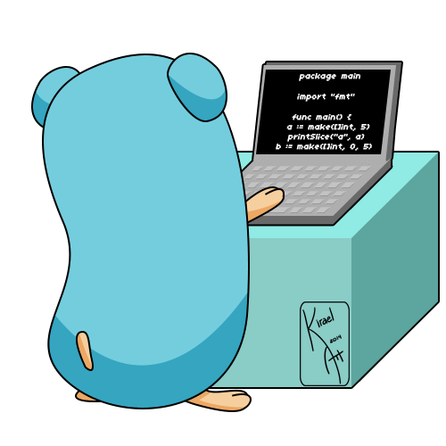

# FAQ
> **学而不思则罔思而不学则殆,勤于梳理,善于总结** 

  

## CONTENT
- [go](golang/src/README.md)
- [docker](docker/README.md)
- [k8s](k8s/README.md)
  - [源码走读](k8s/code_analysis/README.md)
  - [k8s集群监控](k8s/cluster_monitor/README.md)
  - [kubeadm安装集群](k8s/kubeadm/README.md)
  - [ingress-traefik](k8s/traefik/traefik.md)
  - [istio](k8s/istio/istio.md)
  - [helm](k8s/helm/README.md)
    - [使用helm安装harbor](k8s/harbor/harbor.md)
    - [使用helm安装jenkins](k8s/jenkins/jenkins.md)
    - [使用helm安装rook-ceph](k8s/rook/Readme.md)
  - [openfaas](k8s/openfaas/README.md)
- [数据库](db/mysql.md)
- [elk](elk/README.md)
- [git](git/README.md)
- [计算机网络]()
- [数据结构与算法]()
- [现代密码学]()
- [计算机系统](linux/README.md)
- [常用工具](tool/README.md)
- [WEB开发](web/README.md)

## TODO LIST
- [ ] 完成个人微博网站的选型工作 [2019-09-19 ~ 2019-09-23]
- [ ] 搭建一个个人微博系统 [2019-09-24]
- [ ] 完成第一遍博客【go语言编程规范】[2019-09-24] 
