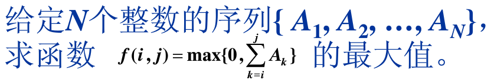

# 数据结构与算法
> 1. 学习MOOC网浙江大学的数据结构课程总结；
>
> 2. 算法是程序的灵魂，要做一个高级工程师，那么必须要有扎实的算法基础;
## 第一讲 基本概念
### 1.1 什么是数据结构？
- 数据对象在计算机中的组织方式
  - 逻辑结构
  - 物理存储结构
- 数据对象必定与一系列加载去其上的操作有关
- 完成这些操作所用的方法就是算法

### 1.2 什么是算法？
#### 1）定义
- 算法（Algorithm）
  - 一个有限指令集
  - 接受一些输入（某些情况下不需要输入）
  - 产生输出
  - 一定在有限步骤之后终止
  - 每一条指令必须：
    - 有充分的明确目标，不可以有歧义
    - 计算机能处理的范围内
    - 描述应该不依赖于任何一种计算机语言以及具体的实现手段
#### 2）什么是好的算法？
- 空间复杂度S(n): 根据算法写成程序在执行时占用存储单元的长度。这个长度往往与输入数据的规模有关。空间复杂度过高的算法可能导致使用的内存超限，造成程序非正常终止。
- 时间复杂度T(n): 根据算法写成的程序在执行时耗费时间的长度。这个长度往往也与输入数据的规模有关。时间复杂度过高的低效算法可能导致我们在有生之年都等不到结果。
- 在分析一般算法效率时，我们经常关注下面两种复杂度：
  - 最坏情况复杂度：T worst(n);
  - 平均复杂度T avg(n);
     T avg(n) <= T worst(n);
- 复杂度的渐进表示法：
  - T(n)=O(f(n)): 表示存在常数C>0,n0>0使得当n>=n0时T(n)<=C*f(n)     
// TODO 大约会算复杂度即可

### 1.3 应用实例：
####最大子列和问题
 
##### 方法一：
```go
func MaxSubseqSum(A []int) int{
	var maxSub int
	for _,a := range A {
		maxSub += a
	}
	
	
}

```


## 第二讲 线性结构
### 2.1 线性表及其实现
#### 多项式的表示
【例】一元多项式及其运算