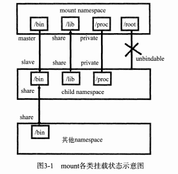
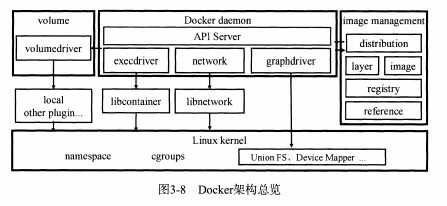
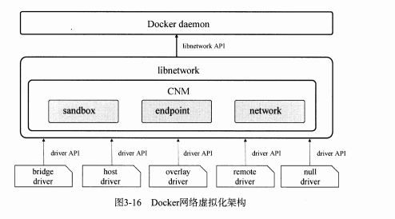
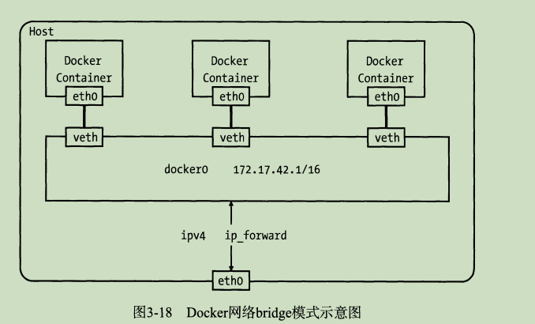

# Docker核心原理
Docker通过namespace实现资源隔离，通过cgroups实现了资源限制，通过写时复制机制实现了高效的文件操作。
## 一、六项隔离技术
- UTS: 主机名域名隔离；
  UTS(UNIX Time-sharing System) namespace提供了主机名和域名的隔离；
- IPC: 信号量、消息队列，共享内存；
  IPC(Inter-Process Communication) 进程间通信；
- NetWork: 网络设备、网络栈、端口等；
     network namespace主要提供了关于网络资源的隔离，包括网络设备、IPv4和Ipv6协议栈、IP路由表、防火墙、/proc/net目录、/sys/class/net目录、套接字等，一个物理网络设备最多存在于一个network namespace中
  ，可以通过创建veth pair（虚拟网络设备对：有两个端，类似于管道，如果数据从一端传入另一端也能收到，反之亦然）在不同的network namespace中间创建通道，已达到通信的目的。shi
     一般情况下，物理设备都分配在最初的rootnamespace(表示系统默认的namespace)中。如果有多块物理网卡，也可以把其中一块或多块分配到新创建的network namespace。需要注意的是：当新建的network namespace 被释放
  时（所有内部进程都终止、并且namespace文件没有被挂载）在这个namespace中的物理网卡会返回到root namespace，而费创建该进程的父进程所在的network namespace。
- User: 用户隔离；
  一个普通用户的进程通过clone创建出来的新进程在新的namespace中可以拥有不同的用户和用户组；这意味着一个进程在容器外属于一个没有权限的普通用户，但是他创建的容器进程却拥有所有的超级权限；

- Mount: 挂载点隔离；
  通过隔离文件挂载点，对隔离文件系统提供支持；
  隔离以后存在的问题：
  1. 父节点namespace中的进程挂载了一张CD-ROM,这时子节点namespace复制的目录结构是无法自动挂载上这张CD-ROM的，因为这种操作会影响到父节点的文件系统；
  问题解决：**挂载传播** 挂载传播定义了挂载对象（mount object）之间的关系，这样的关系包括共享关系和从属关系，系统用这些关系决定任何挂载对象中的挂载时间如何传播到其他挂载对象。
  - 共享关系（share relationship）. 如果两个挂载对象具有共享关系，那么第一个挂载对象中的挂载事件会传播到另一个股灾对象，反之亦然。
  - 从属关系（slave relationship）. 如果两个挂载对象形成从属关系，那么一个挂载对象中的挂载事件会传播到另一个挂载对象，但是反之不行；在这种关系中，从属对象是事件的接收者。
  
  
- PID: 线程隔离

#### PS: 为什么会提示我们关闭Selinux? What it's?
   Selinux是Linux的一个安全策略,将以前单纯的ugo权限,变成用content来识别权限,是Linux权限系统的一次加强.但是,实际应用中,很多人会遇到这样那样的问题.很多编译安装软件的文档,也特意注明了,建议关闭SeLinux.
  
## 二、cgroups 资源限制（control group）
   cgroups是Linux内核提供的一种机制，这种机制可以根据需求把一系列系统任务及其子任务整合（或分隔）到按资源划分等级的不同组内，从而为系统资源管理提供一个统一框架。
 本是上说，cgroup是内核附加在程序上的一系列钩子（hook）,通过程序运行时对资源的调度触发相应的钩子以达到资源追踪和限制的目的。
### 1. cgroups的四个特点：
   - crgoups的api以一个伪文件系统的方式实现，用户态的程序可以通过文件系统操作实现cgroup的组织管理。
   - cgroups的组织管理操作单元可以细粒度到线程级别，另外用户可以创建和销毁cgroup，从而实现资源再分配和管理。
   - 所有资源管理的功能都以子系统的方式实现，接口统一。
   - 子任务创建之初与其父任务处于同一个cgroups的控制组。
   
### 2. cgroups的作用：
- 资源限制：cgroups可以对任务的资源总额进行限制。如果设定应用运行时使用的内存的上线，一旦超过这个配额就触发OOM(Out of Memory)提示；
- 优先级分配：通过分配CPU时间片数量及磁盘IO宽带大小，实际上就相当于限制了任务运行优先级；
- 资源统计：cgroups可以统计系统的资源使用量，如果CPU使用时长、内存使用等，这个功能非常使用于计费；
- 任务控制： cgroups可以对任务执行挂起、恢复等操作；

### 3. cgroups的工作原理：
   cgroups的实现本质上时给任务挂上钩子，当任务运行的过程中涉及某种资源时，就会触发钩子上附带的子系统进行检测，如果进程所需的内存超过它所属的cgroups最大限制后，
   如果设置了OOM Control，那么进程就会收到OOM信号并结束；否则进程会被挂起，进入睡眠状态；Docker默认是开启OOM Control的。
   
### 4. cgroup的配置
```
root@k8s-porter-6cf9dc8c9c-clkgg:/sys/fs/cgroup/cpu# ls -l
total 0
-rw-r--r-- 1 root root 0 May 31 01:45 cgroup.clone_children
--w--w--w- 1 root root 0 May 31 01:45 cgroup.event_control
-rw-r--r-- 1 root root 0 Jun 13 05:53 cgroup.procs
-rw-r--r-- 1 root root 0 May 31 01:45 cpu.cfs_period_us
-rw-r--r-- 1 root root 0 May 31 01:45 cpu.cfs_quota_us // cpu配额限制
-rw-r--r-- 1 root root 0 May 31 01:45 cpu.rt_period_us
-rw-r--r-- 1 root root 0 May 31 01:45 cpu.rt_runtime_us
-rw-r--r-- 1 root root 0 May 31 01:45 cpu.shares
-r--r--r-- 1 root root 0 May 31 01:45 cpu.stat
-r--r--r-- 1 root root 0 May 31 01:45 cpuacct.stat
-rw-r--r-- 1 root root 0 May 31 01:45 cpuacct.usage
-r--r--r-- 1 root root 0 May 31 01:45 cpuacct.usage_percpu
-rw-r--r-- 1 root root 0 May 31 01:45 notify_on_release
-rw-r--r-- 1 root root 0 May 31 01:45 tasks  //记录所有cpu受限制的进程
root@k8s-porter-6cf9dc8c9c-clkgg:/sys/fs/cgroup/cpu# cat tasks 
1
8
9
10
11
root@k8s-porter-6cf9dc8c9c-clkgg:/sys/fs/cgroup/cpu# cat cpu.cfs_quota_us 
30000
root@k8s-porter-6cf9dc8c9c-clkgg:/sys/fs/cgroup/cpu# 
```
## 三、文件系统
// TODO 

## 四、Docker软件架构：
- 1. 典型的C/S架构；
- 2. 后端松耦合结构，不同模块各司其职，有机组合，完成用户请求；



## 五、核心原理
### 1. 网络管理
  - Dokcer1.7版本 抽离网络部分代码成为单独的网络库，即libnetwork.
  - Docker1.9版本中，引入了一整套的docker子命令和跨主机网络支持。
  - 为标准化网络驱动的开发步骤和支持多种网络驱动，Docker公司在libnetwork中使用了CNM(Container Network Model),
    CNM定义了构建容器虚拟化的网络模型，同时还提供了可以用于开发多种网络驱动的标准化接口和组件。
    
    
   - 2. CNM的三个组件&docker的五个网络驱动
    - 2.1 CNM的3个核心组件：
     - sandbox: 一个沙盒包含了一个网络栈的信息。沙盒可以对容器的接口、路由、DNS等设置进行管理。沙盒的实现可以是Linux network namespace
     、[FreeBSD Jail](http://www.kuqin.com/docs/freebsd-handbook/jails.html)或者类似的机制。一个standbox可以有多个端点和网络。
     - endpoint: 一个端点可以可以加入一个沙盒和一个网络。端点的实现可以是veth pair、 Open vSwitch内部端口、或者相似的设备。一个端点只可
     属于一个沙盒和一个网络。
     - network: 一个网络是一组可以直接互相连通的端点。网络的实现可以是Linux bridge、VLAN等。一个网络可以包含多个端点。
    - 2.2 libnetwork 的5种网络驱动
     - birdge驱动：此驱动为docker的默认设置，使用这个驱动，libnetwork将创建出来的docker容器连接到docker网桥上，作为常规的模式，bridge
       模式可以满足Docker容器最基本的使用需求。然而其于外界通信使用[net]()(//TODO)，增加了通信的复杂性，在复杂场景下使用会有多种限制。
     - host驱动：使用这种驱动，libnetwork将不会为容器创建网络协议栈，即不会创建独立的nemespace network.
     - overlay驱动: 此驱动采用 IEFE标准的VXLAN方式，并且是VXLAN中被普遍认为最适合大规模的云计算虚拟化环境的SDN controller模式。在使用过程中需要
     额外配置存储服务，例如：consul、etcd、zookeeper，还需要在启动docker-daemon的时候额外添加参数来指定外部存储。
     - remote驱动：这个驱动实际上并未做真正的网络服务实现，而实调用了用户自行实现的网络驱动插件，是libnetwork实现了驱动可插件化。用户只要根据libnetwork
     提供的协议标准，实现其所需要的各个协议接口并向Docker daemon进行注册。
     - null驱动：使用这个驱动时，dockers容器拥有自己的网络命名空间，但是并不会为进行任何的网络配置。它给了用户最大的自由度来自定义容器网络；
   - 3. birdge驱动实现机制分析
     - docker0网桥：
       - 安装好docker后，执行ifconfig会发现多了一个docker0的网卡，并且宿主机会在内核路由表上添加到达响应网络的静态路由，可以通过`route -n`
       查看。
       ```
       $ route -n 
       172.17.0.0      0.0.0.0         255.255.0.0     U     0      0        0 docker0
       ```
       **宿主机与docker容器通信** 此条路由表标识所有目的ip地址为172.17.0.0/16的数据包都从docker0网卡发出
       - 后续没创建一个容器会在主机上增加一个veth开头的设备对，设备的一端连接docker0网桥，另一端就是容器中的eth0;
       
       
       - 这里的网桥相当于交换机，为连在其上的设备转发数据帧；
       - 网桥上的veth网卡设备相当于交换机端口，可以将多个容器或虚拟机连接在其上，这些端口工作在二层，所以不需要配置ip信息。
     - 关于docker0网桥的设置：
       docker0网桥实在docker daemon启动的时候创建的，其IP默认为172.17.0.1/16，之后创建的docker容器都是在网桥上分配ip，并连接到docker0网桥
       Docker提供了如下参数可以帮助用户自定义docker0设置。
       - --bip=CIDR: 设置docker0的IP地址和子网范围，使用CIDR格式，
       - --fixed-cidr=CIDR: 限制docker容器获取IP的范围。docker容器默认获取Ip的范围是docker网桥的子网范围，此参数可以将其缩小到某个子网范围内。
       - --mtu=BYTES: 指定docker0最大传输单元。
       - --birdge: 通过此参数指定自己创建的网桥。
     - iptable规则：
       - Docker安装好后，默认会在宿主机上增加一些Iptable规则以用于docker容器之间，容器和宿主机之间以及和外界的通信，可以使用`iptables-save`
       进行查看。其中NAT表上POSTROUTING链上多了一条如下规则：
       ```
       $ iptables-save
       ....
       -A POSTROUTING -s 172.17.0.0/16 ! -o docker0 -j MASQUERADE
       ....
       ```
       这条规则关系着docker0和外网通信，含义是将源地址为172.17.0.0/16的数据包，当不是从docker0网卡发出时替换源ip地址为当前网卡地址；
     - docker容器的DNSHE和主机名
       - 在/etc目录下有三个文件是在容器启动的时候被覆盖掉的，分别是/etc/hostname、/etc/hosts、/etc/resolv.conf,通过容器中运行mount命令查看。
       ```
       $ mount
       /dev/vdb on /etc/resolv.conf type ext4 (rw,relatime)
       /dev/vdb on /etc/hostname type ext4 (rw,relatime)
       /dev/vdb on /etc/hosts type ext4 (rw,relatime)
       ```
       这样的做法可以使修改主机名、DNS等信息变得容易，Docker提供了通过参数去修改这些文件的配置，分别如下：
       - -h HOSTNAME 或者 --hostname=HOSTNAME:设置主机别名，别名会被写在/etc/hostname文件中。
       - -dns IP_ADDRESS...: 为容器配置DNS, 写在/etc/resolv.conf中，这个参数既可以在docker daemon启动的时候设置，也可在docker run的时候指定
       默认为8.8.8.8和8.8.8.4
       以上参数不会被commit到容器镜像中；
        
   // TODO

## **问题汇总**
### 1. 通过docker客户端pull or push 镜像如何跳过证书认证 ?
> Reference: https://docs.docker.com/registry/insecure/

1. 增加如下配置：
```
$ cat >/etc/docker/daemon.json <<-EOF
{
  "insecure-registries" : ["repository.docker.com"]
}
EOF
```

2. 重启DOCKER:
```
$ systemctl restart docker
```


