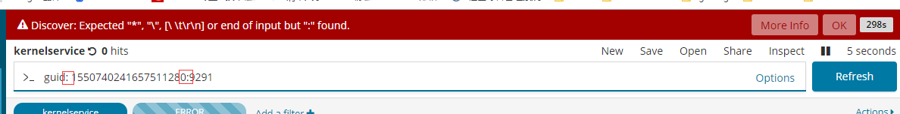
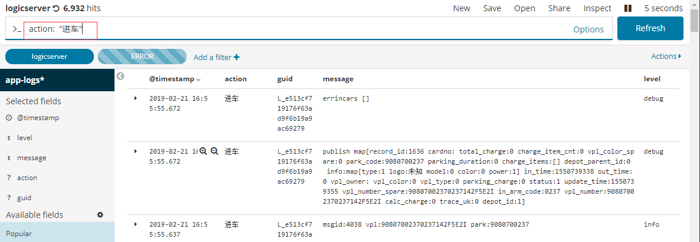
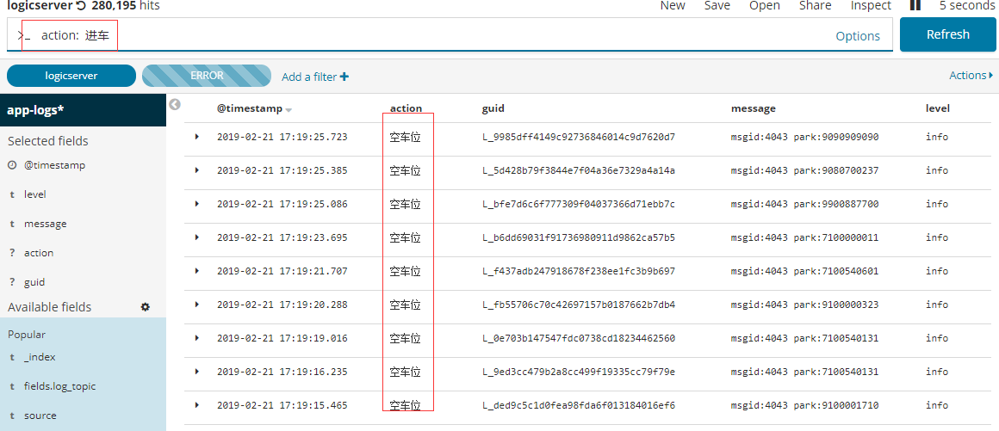

# kibana


## 一、安装：
### 1.1 下载安装包
```
$ wget https://artifacts.elastic.co/downloads/kibana/kibana-6.5.4-linux-x86_64.tar.gz
```

### 1.2 解压修改配置
```
$ tar -xzvf kibana-6.5.4-linux-x86_64.tar.gz
$ cd kibana-6.5.4-linux-x86_64
$ vi config/kibana.yml

server.port: 5601
server.host: "0.0.0.0"
elasticsearch.url: "http://localhost:9200"
```

### 1.3 启动
```
$ nohup ./kibana & 
```

### 1.4 容器化部署
```
$ kubectl run kibana -nelk --image=docker.elastic.co/kibana/kibana:6.5.4
```

```yaml
apiVersion: v1
kind: PersistentVolumeClaim
metadata:
  annotations:
    volume.beta.kubernetes.io/storage-provisioner: ceph.rook.io/block
  name: kibana
  namespace: elk
spec:
  accessModes:
  - ReadWriteOnce
  resources:
    requests:
      storage: 2Gi
  storageClassName: rook-ceph-block
```

### 二、常见问题
1. 如何制作时序表按照日志级别统计日志数量 ？
> 参考：
  // 饼状图参考
  1. https://yq.aliyun.com/articles/490494?spm=a2c4e.11153940.blogcont208365.26.5e594d69LXM3J8
  
  2. 日志输出在同一毫秒内会导致日志排序混乱；
  
### 三、使用总结
1. 查询关键字中不能有多个 ‘:’,如果在kibana搜索框中搜索时，关键字中带有冒号，会被认为是对一个字段key:value的匹配，
搜索的内容中带有“:”,可以用*替换；

2. 要搜索的内容是一个整体时最好加上双引号，如搜索 <code>进车</code> 和搜索 <code>"进车"</code>的结果是不一样的
不带双引号时，es会按照单个字符的相似度做查询结果展示；



### 四、告警规则设置

```
{
  "actions": {
    "Webhook_75f3bede-8759-43b1-8fd7-2e6d0dc93b87": {
      "name": "Webhook",
      "throttle_period": "1m",
      "webhook": {
        "priority": "high",
        "stateless": false,
        "method": "POST",
        "host": "wechat-mp-service.srv.parkingwang.com",
        "port": "80",
        "path": "https://wechat-mp-service.srv.parkingwang.com/template_messages",
        "body": "{\n\t\"tag_name\": \"test\",\n\t\"template_name\": \"service_alarm\",\n\t\"content\": {\n\t\t\"first\": \"生产环境服务异常\",\n\t\t\"keyword1\": \"park-record\",\n\t\t\"keyword2\": \"生产环境微服务管理平台\",\n\t\t\"keyword3\": \"10分钟内累计发现服务有{{payload.hits.total}}条ERROR日志\",\n\t\t\"keyword4\": \"ERROR\",\n\t\t\"remark\": \"请及时登陆日志系统查看处理！\"\n\t},\n\t\"url\": \"https://kibana.parkingwang.com/app/kibana\"\n}",
        "params": {
          "watcher": "{{watcher.title}}",
          "payload_count": "{{payload.hits.total}}"
        },
        "headers": {
          "Content-Type": "application/json"
        },
        "auth": "",
        "message": "park-record 服务异常，10分钟内ERROR数超过5个，请及时关注；"
      }
    }
  },
  "input": {
    "search": {
      "request": {
        "index": [
          "app-logs-park-record*"
        ],
        "body": {
          "query": {
            "bool": {
              "must": [
                {
                  "match": {
                    "level": "error"
                  }
                }
              ],
              "filter": {
                "range": {
                  "@timestamp": {
                    "gte": "now-10m/m",
                    "lte": "now/m",
                    "format": "epoch_millis"
                  }
                }
              }
            }
          },
          "size": 0,
          "aggs": {
            "dateAgg": {
              "date_histogram": {
                "field": "@timestamp",
                "time_zone": "Europe/Amsterdam",
                "interval": "10m",
                "min_doc_count": 1
              }
            }
          }
        }
      }
    }
  },
  "condition": {
    "script": {
      "script": "payload.aggregations.dateAgg.buckets.some(b => b.doc_count>5)"
    }
  },
  "trigger": {
    "schedule": {
      "later": "every 10 minutes"
    }
  },
  "disable": false,
  "report": false,
  "title": "watcher_park-record",
  "save_payload": true,
  "spy": false,
  "impersonate": false
}
```
