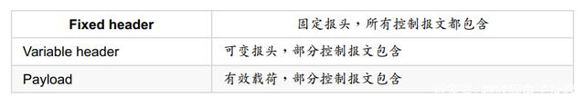
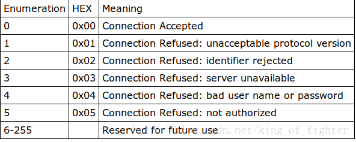

# MQTT协议
### 1. mqtt是什么？
> 参考：https://baijiahao.baidu.com/s?id=1608411516249221334&wfr=spider&for=pc
 - MQTT协议（Message Queuing Telemetry Transport）,翻译过来就是遥信消息队列传输，是IBM公司于1999年提出的，现在最新版本是3.1.1。
 - MQTT是一个基于TCP的发布订阅协议，设计的初始目的是为了极有限的内存设备和网络带宽很低的网络不可靠的通信，非常适合物联网通信。
 
### 2. 为什么会出现？

### 3.原理？

### 4 详解

#### 4.1MQTT消息的QOS

MQTT支持三种QOS等级：

- QoS 0：“最多一次”，消息发布完全依赖底层 TCP/IP 网络。分发的消息可能丢失或重复。例如，这个等级可用于环境传感器数据，单次的数据丢失没关系，因为不久后还会有第二次发送。

- QoS 1：“至少一次”，确保消息可以到达，但消息可能会重复。

- QoS 2：“只有一次”，确保消息只到达一次。例如，这个等级可用在一个计费系统中，这里如果消息重复或丢失会导致不正确的收费。

#### 4.2 MQTT的消息类型

- 1 CONNECT – 连接服务端：客户端到服务端的网络连接建立后， 客户端发送给服务端的第一个报文必须是CONNECT报文
- 2 CONNACK – 确认连接请求：服务端发送CONNACK报文响应从客户端收到的CONNECT报文。 服务端发送给客户端的第一个报文必须是CONNACK。如果客户端在合理的时间内没有收到服务端的CONNACK报文， 客户端应该关闭网络连接。合理的时间取决于应用的类型和通信基础设施。
- 3 PUBLISH – 发布消息：PUBLISH控制报文是指从客户端向服务端或者服务端向客户端传输一个应用消息。
- 4 PUBACK –发布确认：PUBACK报文是对QoS 1等级的PUBLISH报文的响应。
- 5 PUBREC – 发布收到（ QoS 2， 第一步）：PUBREC报文是对QoS等级2的PUBLISH报文的响应。 它是QoS 2等级协议交换的第二个报文。
- 6 PUBREL – 发布释放（ QoS 2， 第二步）：PUBREL报文是对PUBREC报文的响应。 它是QoS 2等级协议交换的第三个报文。
- 7 PUBCOMP – 发布完成（ QoS 2， 第三步）：PUBCOMP报文是对PUBREL报文的响应。 它是QoS 2等级协议交换的第四个也是最后一个报文。
- 8 SUBSCRIBE - 订阅主题：客户端向服务端发送SUBSCRIBE报文用于创建一个或多个订阅。 每个订阅注册客户端关心的一个或多个主题。 为了将应用消息转发给与那些订阅匹配的主题， 服务端发送PUBLISH报文给客户端。 SUBSCRIBE报文也（ 为每个订阅） 指定了最大的QoS等级， 服务端根据这个发送应用消息给客户端。
- 9 SUBACK – 订阅确认：服务端发送SUBACK报文给客户端， 用于确认它已收到并且正在处理SUBSCRIBE报文。
- 10 UNSUBSCRIBE –取消订阅：客户端发送UNSUBSCRIBE报文给服务端， 用于取消订阅主题。
- 11 UNSUBACK – 取消订阅确认：服务端发送UNSUBACK报文给客户端用于确认收到UNSUBSCRIBE报文。
- 12 PINGREQ – 心跳请求：客户端发送PINGREQ报文给服务端的。 用于：1. 在没有任何其它控制报文从客户端发给服务的时， 告知服务端客户端还活着。2. 请求服务端发送 响应确认它还活着。3. 使用网络以确认网络连接没有断开。
- 13 PINGRESP – 心跳响应：服务端发送PINGRESP报文响应客户端的PINGREQ报文。 表示服务端还活着。
- 14 DISCONNECT –断开连接：DISCONNECT报文是客户端发给服务端的最后一个控制报文。 表示客户端正常断开连接。

#### 4.3 MQTT控制报文格式

### 5 MQTT服务器简介
> 参控：https://blog.csdn.net/anxianfeng55555/article/details/80908795

如果不想使用云平台，只是纯粹地玩一下MQTT，或者只想在内网对设备进行监控，那么可以自己本地部署一个MQTT服务器。下面介绍几款MQTT服务器：
Apache-Apollo：一个代理服务器，在ActiveMQ基础上发展而来，可以支持STOMP、AMQP、MQTT、Openwire、SSL和WebSockets等多种协议，并且Apollo提供后台管理页面，方便开发者管理和调试。
EMQ：EMQ 2.0，号称百万级开源MQTT消息服务器，基于Erlang/OTP语言平台开发，支持大规模连接和分布式集群，发布订阅模式的开源MQTT消息服务器。
HiveMQ：一个企业级的MQTT代理，主要用于企业和新兴的机器到机器M2M通讯和内部传输，最大程度的满足可伸缩性、易管理和安全特性，提供免费的个人版。HiveMQ提供了开源的插件开发包。
Mosquitto：一款实现了消息推送协议MQTT v3.1的开源消息代理软件，提供轻量级的、支持可发布/可订阅的消息推送模式。

### 5.1 服务器安装
> 参考： https://www.jianshu.com/p/ebbe25d1c4b2

### 5.2 连接返回状态码

